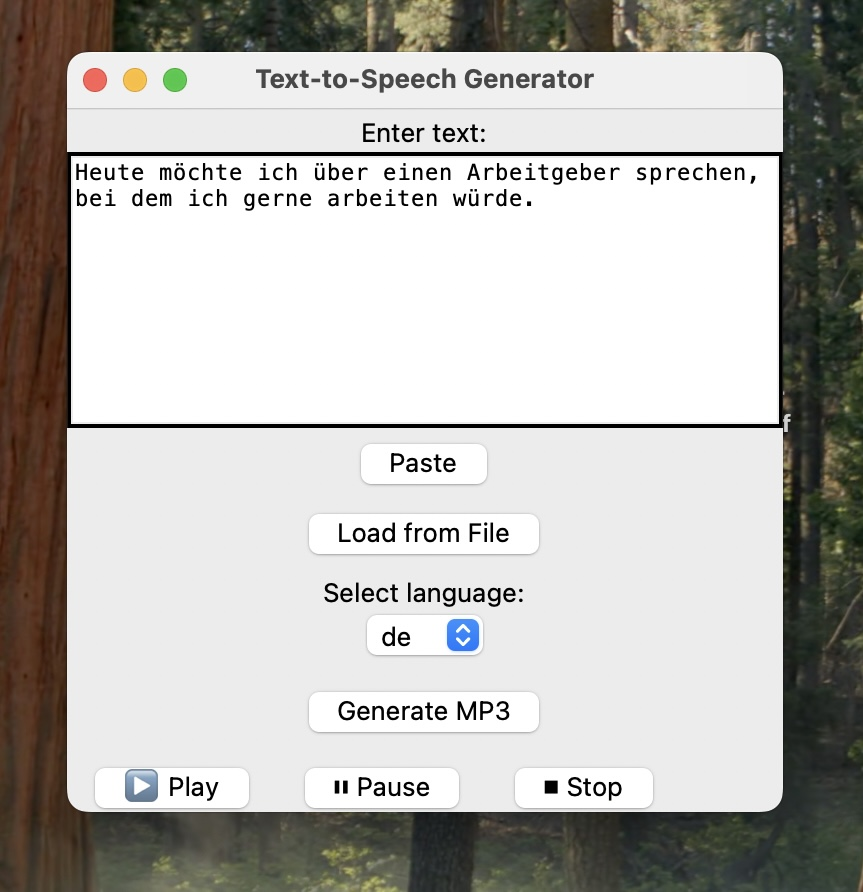

# LinguaCast: Personal Text-to-Speech Studio

A simple and user-friendly desktop application for converting text to speech (MP3) using the [gTTS (Google Text-to-Speech)](https://pypi.org/project/gTTS/) library. Supports input from manual text, `.txt`, `.pdf`, and `.docx` files. Built with Python and Tkinter.


# Features

*  Intuitive graphical interface using `tkinter`
*  Load text from `.txt`, `.pdf`, or `.docx` files
*  Convert text to `.mp3` using `gTTS`
*  Choose from 30+ supported languages
*  Built-in audio player: **Play / Pause / Stop**
*  Paste text with right-click menu or keyboard shortcut


# Screenshots




# Requirements

* Python 3.7+
* [gTTS](https://pypi.org/project/gTTS/)
* [pygame](https://pypi.org/project/pygame/)
* [PyPDF2](https://pypi.org/project/PyPDF2/)
* [python-docx](https://pypi.org/project/python-docx/)

Install requirements:

```bash
pip install gTTS pygame PyPDF2 python-docx
```


#  How to Run

1. Clone this repository or download the source code.
2. Run the script:

```bash
python app.py
```


#  File Support

* `.txt` — loaded as plain text
* `.pdf` — text is extracted using `PyPDF2`
* `.docx` — text extracted from paragraphs


# Use Cases

* Language learning: create personalized audio flashcards
* Reading notes aloud
* Preparing for presentations
* Text accessibility support


#  License

This project is licensed under the **MIT License** — feel free to use, modify, and distribute.


# Contributing

Pull requests are welcome! If you want to suggest improvements, fix bugs, or add features — go for it.


# Author

Created by Inna Konar — making language learning more musical and efficient.
